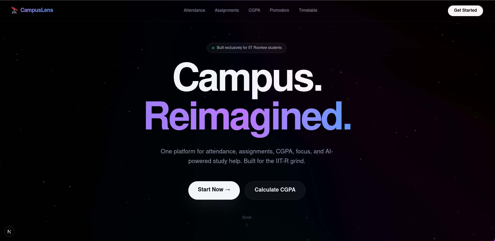
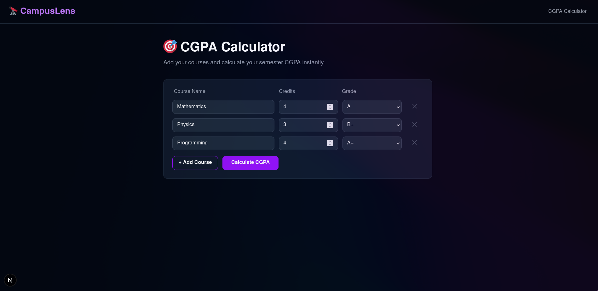
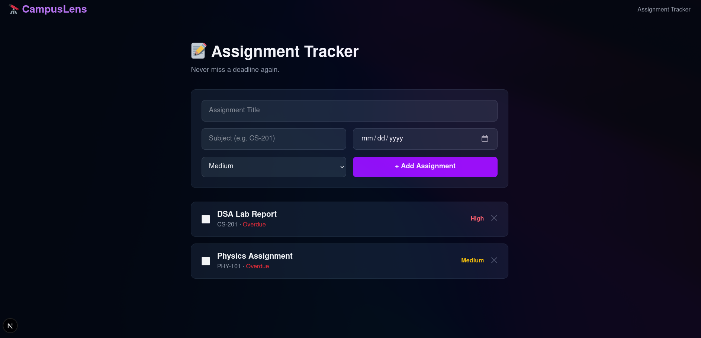
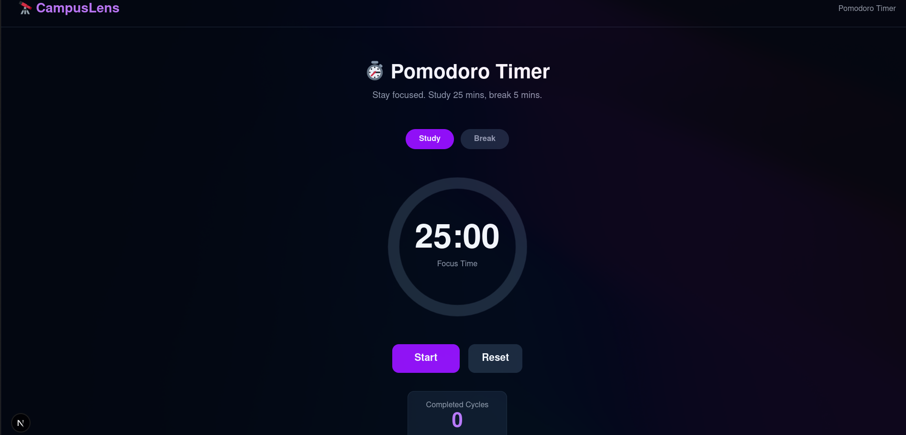
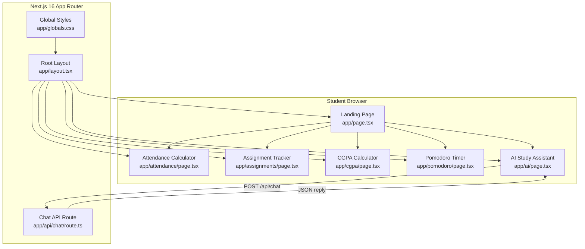
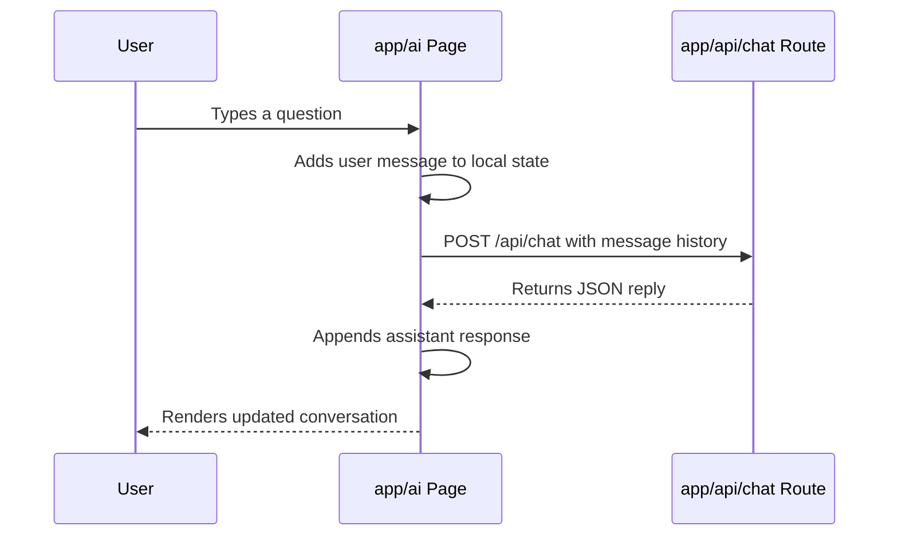
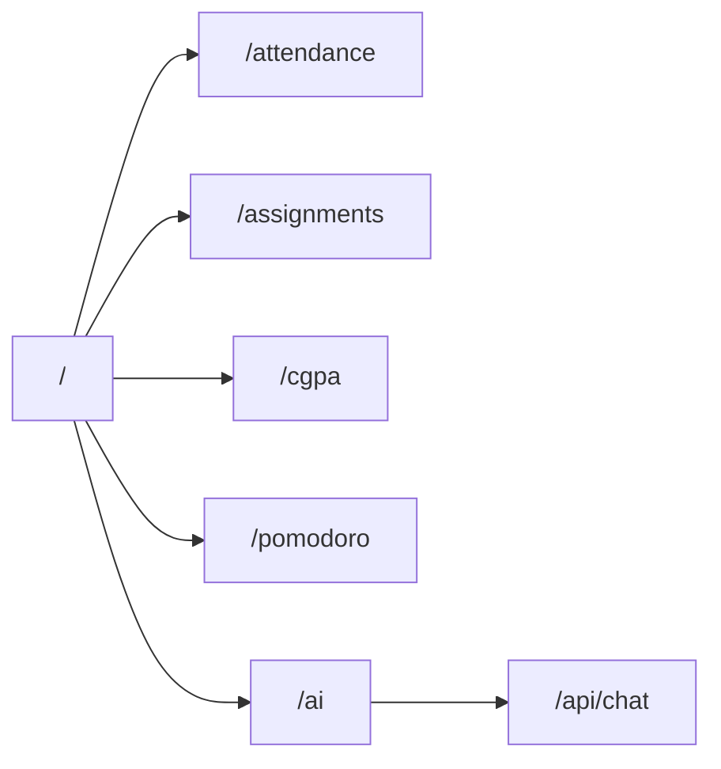

# CampusLens

**Academic productivity platform built exclusively for IIT Roorkee students.**

CampusLens consolidates the day-to-day academic management needs of IITR students into a single, cohesive interface — attendance tracking, assignment management, CGPA calculation, focused study sessions, timetable management, and an AI-powered study assistant.

---

## Demo

Watch the full walkthrough on YouTube: Click the banner below

[](https://www.youtube.com/watch?v=m2ppbu-TX8U)

---

## Screenshots

### Landing Page


### CGPA Calculator


### Assignment Manager


### Pomodoro Timer


---

## Features

| Module | Description |
|---|---|
| Attendance Tracker | Calculates bunkable classes and attendance deficit against the 75% threshold |
| Assignment Manager | Deadline-sorted task board with subject tagging and priority levels |
| CGPA Calculator | IIT Roorkee grade-point system with per-course breakdown and semester CGPA |
| Pomodoro Timer | 25/5 focus cycles with session history to build study consistency |
| Timetable Manager | Visual weekly schedule grid tailored to the IITR course structure |
| AI Study Assistant | Claude-powered conversational assistant for subject-specific academic queries |

---

## Architecture

### Application Structure



### Request Flow — AI Study Assistant



### Page Routing



---

## Tech Stack

| Layer | Technology |
|---|---|
| Framework | Next.js 16 (App Router) |
| Language | TypeScript |
| Styling | Tailwind CSS v4 |
| AI Integration | Anthropic Claude API |
| Runtime | Node.js |

---

## Getting Started

### Prerequisites

- Node.js 18 or later
- An Anthropic API key (for the AI Study Assistant)

### Installation

```bash
git clone https://github.com/your-username/campuslens.git
cd campuslens
npm install
```

### Environment Configuration

Create a `.env.local` file in the project root:

```env
ANTHROPIC_API_KEY=your_api_key_here
```

### Running Locally

```bash
npm run dev
```

Open [http://localhost:3000](http://localhost:3000) in your browser.

---

## Project Structure

```
campuslens/
├── app/
│   ├── page.tsx              # Landing page with feature overview
│   ├── layout.tsx            # Root layout and global metadata
│   ├── globals.css           # Global styles
│   ├── attendance/           # Attendance tracker module
│   ├── assignments/          # Assignment manager module
│   ├── cgpa/                 # CGPA calculator module
│   ├── pomodoro/             # Pomodoro timer module
│   ├── timetable/            # Timetable manager module
│   ├── ai/                   # AI study assistant module
│   └── api/
│       └── chat/             # Claude API proxy route
├── public/                   # Static assets
├── sample/                   # Application screenshots
└── next.config.ts
```

---

## Contributing

Contributions are welcome from IITR students and alumni. Please open an issue to discuss proposed changes before submitting a pull request.

---

## License

MIT License. See [LICENSE](./LICENSE) for details.

---

Built for the IIT Roorkee community. CampusLens 2025.
